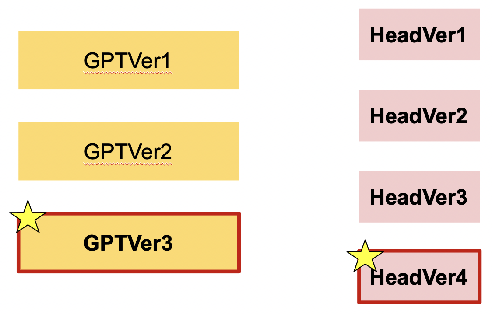
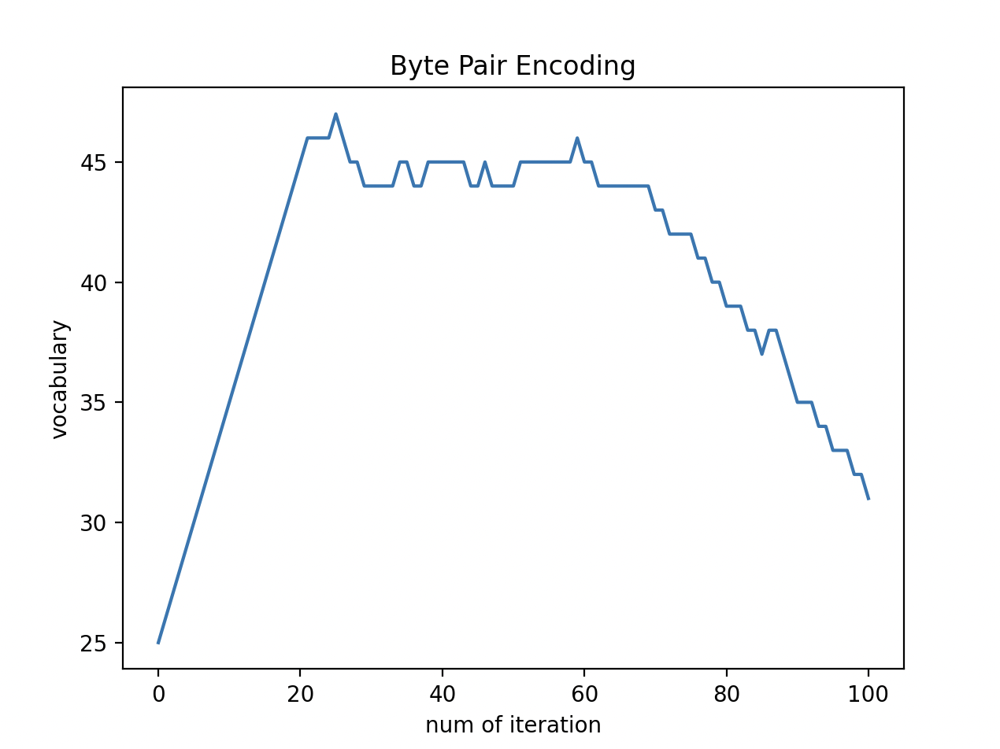

# learnGPT - week1

## Requirements

### Python version
```bash
python --version
```
```text
Python 3.9.12
```
### Libraries used
```bash
pip3 install torch==1.13.1 pytest==7.2.1 pyyaml==6.0
```

## TODO's
### TODO 1 - a naive LM (`GPTVer1`)

```bash
pytest tests/test_1.py -s -vv
```


### TODO 2 - taking the past into account  (`HeadVer1` & `GPTVer2`)

```bash
pytest tests/test_2.py -s -vv
```


### TODO 3 - vectorizing for loops (`HeadVer2`)

```bash
pytest tests/test_3.py -s -vv
```

### TODO 4 - taking the past into account with masking & normalization (`HeadVer3`)

```bash
pytest tests/test_4.py -s -vv
```

### TODO 5 - self-attention mechanism (`HeadVer4` & `GPTVer2`)

```bash
pytest tests/test_5.py -s -vv
```

### TODO 6 - positional encodings (`GPTVer3`)

```bash
pytest tests/test_6.py -s -vv
```

<br>

## Introduction


Onboarding Course week1에서는 character leve tokenizer를 사용하는 Simplest BigramLanguageModel을 발전시켜보고 합니다.

Data는 Shakespeare의 희곡 대본을 input.txt로 제공해드렸지만, 원하는 text를 사용하셔도 무관합니다.

week1의 최종 목표는 one-head self-attention(HeadVer4)를 적용한 GPTVer3를 구현하는 것입니다.

## Tokenization
자연어처리를 위해선 말뭉치를 적절히 전처리 해야합니다. 

Tokenization은 전처리 과정의 시작으로, 말뭉치를 token이라는 단위로 나눠주는 작업을 말합니다. 그런데 토큰화를하다보면 여러 선택의 순간이 발생합니다. 가령 *I don’t like olive* 라는 문장이 존재할 때 *don’t*를 토큰화하는 방법은 다양합니다. 

- don / t
- dont
- do  / n’t

train할 전체 text를 tokenization하면 이를 바탕으로 vocabulary를 만들어 token을 정수로 인코딩을 합니다. 그런데 inference를 하는 과정에서 가령 오타와 같이 vocabulary에 없는 단어(train 단계에서 접하지 못한 단어)가 존재하는 경우 OOV(Out-Of-Vocabulary) 문제가 발생하게 됩니다.

위와 같은 문제들을 해결하기 위해 다양한 tokenization 전략이 연구되었고, 그중 BPE(Byte Pair Encoding)를 main_bpe.py에 간단히 구현해봤습니다. BPE로 vocabulary를 구성하면 위와 같이 초반에는 vocabulary size가 증가하다가 점점 감소하는 경향을 보입니다.



```text
💡 본 코스에선 Character level tokenizer를 사용합니다.
```

## GPTVer1
`GPTVer1`은 `context`가 주어지고 다음 token을 예측 할 때 오직 직전 token만을 참고하는 BigramLM입니다. 

$$
P(w|like) =  {count(like , w)\over count(like)}
$$

가령 `context` 에서 like가 10번 등장했고, like apple이 8번 like orange가 2번 등장했다면 $P(apple|like)$ 는 0.8,  $P(orange|like)$ 는 0.2가 됩니다. BigramLM은 이처럼 마지막 token에 대해 다음에 올 token에 대한 확률을 바탕으로 하는 LM입니다.

`GPTVer1` 에선 (`vocab_size` x `vocab_size`)의 `token_embedding_table`을 만들고 이를 학습합니다. 각 token의 정수 인코딩 값은 table의 index에 대응하고, `token_embedding_table(index)`는 다음에 나올 토큰에 대한 로짓값이 됩니다.

Language Model로 text를 `generate`할 때 classification처럼 max probability를 선택하는 것이 아니라 확률분포에서 다음 토큰을 임의추출합니다. 

GPTVer1에서는 generate 함수를 구현하는 것을 목표로 합니다.

```bash
# hint
idx_next = torch.multinomial(probs, num_samples=1)
```

## HeadVer1 & GPTVer2

`GPTVer1` 은 직전 token의 정보만을 토대로 다음 token을 예측합니다. 하지만, 이 경우 앞 부분과 뒷 부분의 문맥이 전혀 연결되지 않는 경우도 생길 수 있습니다.

`GPTVer2`와 `HeadVer1`에서는 직전 token과 함께 이전 token들의 embedding vector의 평균으로 다음 token을 예측하고자 합니다. 가령 4th token을 예측하고자 하면 1st, 2nd, 3rd token의 embedding vector의 평균으로 다음 token을 예측하고자 합니다.

HeadVer1에서는 이를 **2중 for문을 사용하여 구현해주세요**

`hint: Each example across batch dimension is of course processed completely independently and never "talk" to each other`

GPTVer2에서는 embedding table이 (`vocab_size` x `embed_size`)로 변경됐습니다. 최종 단계에서 fully connected layer(self.lm_head)를 사용하여 logits을 (`batch_size`, `block_size`, `vocab_size`)로 만들어주세요.

`hint: embedding table → Head → FC`

## HeadVer2
HeadVer2에서는 HeadVer1을 **matrix multiplication을 사용하여 구현해주세요**

`hint: torch.tril(...)`

## HeadVer3
HeadVer3에서는 HeadVer2를 **softmax를 사용하여 구현해주세요**

`hint: softmax([0, 0, -inf, -inf]) = [0.5, 0.5, 0, 0]`

## HeadVer4 (Self-attention Head)
HeadVer4에서는 **self-attention head를 구현해보고자 합니다. softmax를 적용할 때 HeadVer3의 전략을 사용하여 구현해주세요.**

$$
Attention(Q, K, V) = softmax({QK^T \over \sqrt d_k})V
$$

TODO 위의 if debug: 는 test code를 위한 부분이니, 이 부분은 수정하지 말아주세요.

HeadVer4에서는 scailing을 잘 했는지와 softmax를 잘 적용했는지에 대해 test를 합니다. 이때 test code 적용에 필요한 parameter를 저장해주셔야합니다. 아래는 pseudo code이고 각 연산을 마무리하고 해당 변수에 저장하시면 됩니다.

1. self.var = (Q@K^T / sqrt(d_k)).var() ← scailing 이후 variance를 저장하시면 됩니다.
2. self.wei = Attention(Q, K, V) ← 최종 wei를 저장하시면 됩니다.

`hint: "Scaled" attention additional divides wei by 1/sqrt(head_size). This makes it so when input Q,K are unit variance, wei will be unit variance too and Softmax will stay diffuse and not saturate too much.`

## GPTVer3
완성한 HeadVer4를 사용하여 GPTVer3 구현하고자 합니다.

위에서 구현한 HeadVer4는 과거의 정보를 반영을 하지만, RNN과 달리 Sequential data를 반영하지 못합니다. 이를 해결하기 위해 **Positional encoding과 최종 logits을 구현해봅니다.**

GPTVer3에서도 embedding table의 shape이 (`vocab_size` x `embed_size`) 입니다. 최종 단계에서 fully connected layer(self.lm_head)를 사용하여 logits을 (`batch_size`, `block_size`, `vocab_size`)로 만들어주세요.

### Positional encoding

[https://towardsdatascience.com/master-positional-encoding-part-i-63c05d90a0c3](https://towardsdatascience.com/master-positional-encoding-part-i-63c05d90a0c3)

[https://www.notion.so/WEEK9-How-does-Positional-Encoding-work-0d0e5b9d17464af08f39b4977c073beb#f77f059d74ae45599eca16c1b3924e91](https://www.notion.so/0d0e5b9d17464af08f39b4977c073beb)

### Logits
```bash
# pseudo code
x = tok_emb + pos_emb
x = head(x)
logits = FC(x)
```
