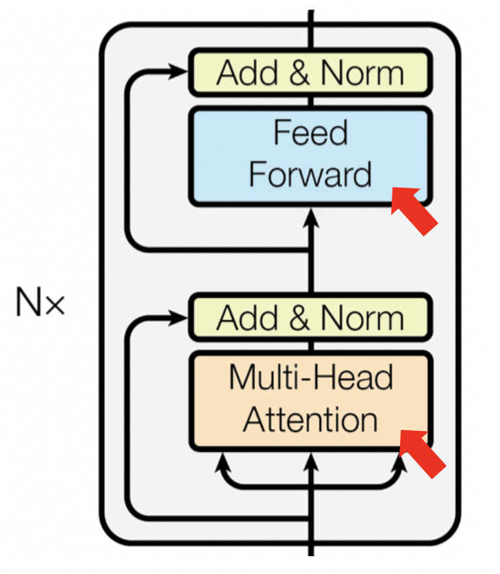
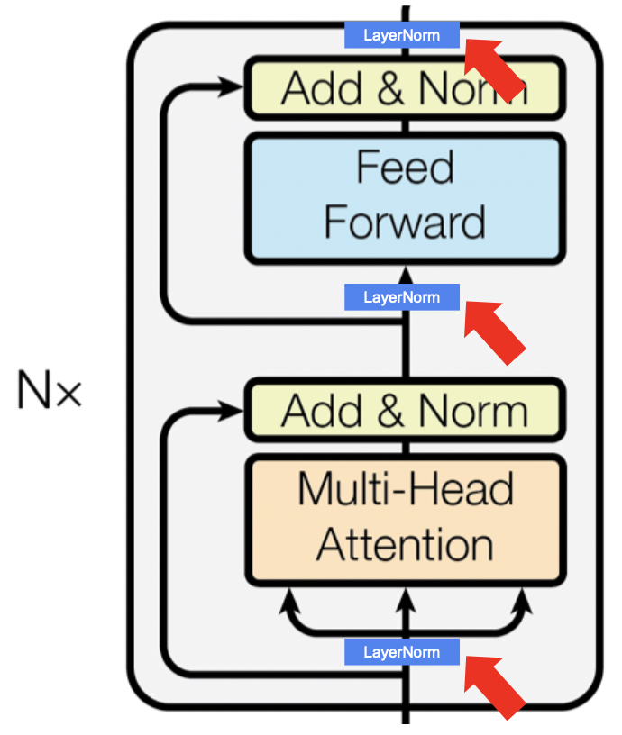
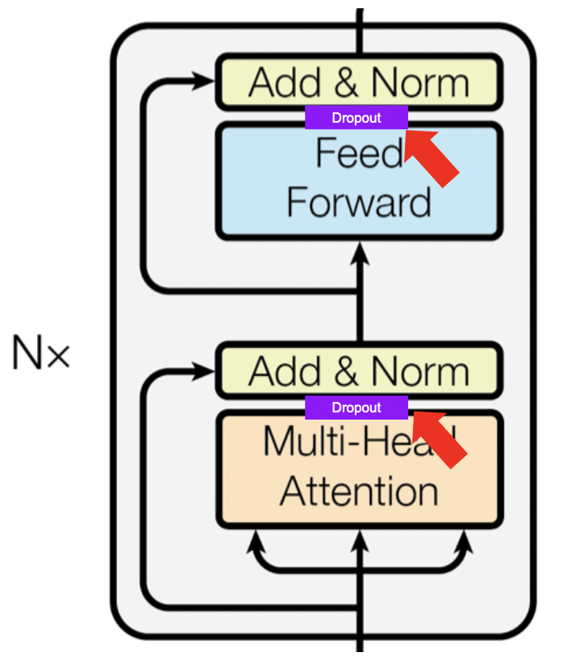

# learnGPT - week 2

## Requirements

### Python version
```bash
python --version
```
```text
Python 3.9.12
```
### Libraries used
```bash
pip3 install torch==1.13.1 pytest==7.2.1 pyyaml==6.0
```

## Introduction
week2에서는 week1에서 완성한 GPTVer3(one-head self-attention + positional encoding)와 HeadVer4(self-attention head)를 더 발전시켜 최종적으로 NanoGPT를 구현하는 것을 목표로 합니다.

## `test_7.py` (Team 1)

```shell
pytest tests/test_7.py -s -vv
```

### test_head_ver_4_and_multi_head_ver_1_are_equally_expensive & test_multi_head_helps


Week1에서 구현했던 `HeadVer4`(self-attention head)를 바탕으로 multi-head attention을 구현합니다.
self-attention head에서 Q, K, V가 각각 FC layer를 통과하고나면 (batch_size, block_size, embed_size) → (batch_size, block_size, head_size)로 shape이 변경이 됩니다.
그리고 embed_size = head_size * n_heads의 관계가 성립합니다.

> TODO 1: `MultiHeaVer1.forward`를 구현해주세요.
> input x를 n_heads 개의 self-attention head를 통과한 후 head_output을 concatnate합니다. 그리고 projection layer(FC)를 통과시켜 multi-head attention을 구현해주세요.

테스트를 돌려보고 다음의 질문에 답해주세요.
1. `MultiHeadVer1`와 `HeadVer4`의 연산량에 차이가 있나요? 없다면 왜?
2. `MultiHeadVer1`와 `HeadVer4` 중 어떤 것이 더 좋은 성능을 보이나요? 그 이유는 무엇인가요?

### test_multi_head_ver_2_is_faster_than_ver_1 & test_multi_head_ver_1_and_multi_head_ver_2_are_logically_equal

테스트를 돌려보고 다음의 질문에 답해주세요.
1. `MultiHeadVer2`와 `MultiHeadVer1`는 알고리즘에 차이는 없지만 `MultiHeadVer2`가 연산 속도가 더 빠릅니다. 그 이유는 무엇인가요?
---

## `test_8.py` (Team 2)

```shell
pytest tests/test_8.py -s -vv
```

### test_ffn_helps



`BlockVer1`은 위에서 구현한 Multi-Head Attention과 FeedForward를 수행합니다.

> TODO 2-1: `FeedForward`를 구현해주세요.

> TODO 2-2: `BlockVer1.forward`을 구현해주세요. Multi-Head Attention을 통과한 뒤 FeedForward layer를 통과시키면 됩니다.

테스트를 돌려보고 다음의 질문에 답해주세요.
1. `MultiHeadVer2`와  `BlockVer1` 중 어떤 것이 더 좋은 성능을 보이나요? 그 이유는 무엇인가요?


### test_residual_conn_helps_when_network_is_deep


`BlockVer2`는 BlockVer1에서 Residual connection을 추가한 Block입니다.

> TODO 2-3: `BlockVer2.forward`를 구현해주세요. Multi-Head Attention과 FeedForward에 대해 각각 residual Connection을 추가하면 됩니다.


테스트를 돌려보고 다음의 질문에 답해주세요.
1. `BlockVer1`과 `BlockVer2` 중 어떤 것이 더 좋은 성능을 보이나요? 그 이유는 무엇인가요?

---

## `test_9.py` (Team 3)

```shell
pytest tests/test_9.py -s -vv
```

### test_layer_norm_features_dim_is_properly_normalized & test_layer_norm_mitigates_vanishing_gradient


> TODO 3-1: `BlockVer3`에서 사용할 `LayerNorm`을 구현해주세요.

테스트를 돌려보고 다음의 질문에 답해주세요.
1. `LayerNorm`을 통과한 후에는 어떤 특징이 있나요?
2. `LayerNorm`은 어떻게 기울기 소실 문제를 완화하나요?

### test_layer_norm_helps_when_network_is_deep




> TODO 3-2: `BlockVer3.forward`를 구현해주세요. LayerNorm을 위의 그림처럼 Multi-Head의 input, FeedForward의 input 총 2곳에 추가하시면 됩니다.

테스트를 돌려보고 다음의 질문에 답해주세요.
1. `BlockVer2`와 `BlockVer3` 중 어떤 것이 더 좋은 성능을 보이나요? 그 이유는 무엇인가요?

--- 

## `test_10.py` (Team 4)

```shell
pytest tests/test_10.py -s -vv
```
### test_block_ver_4_output_is_always_different_in_train_mode & test_block_ver_4_output_is_always_the_same_in_eval_mode



> TODO 4: `BlockVer4.__init__`을 구현해주세요. Dropout layer를 추가하면됩니다. Dropout은 Multi-Head의 output, FeedForward의 output 총 2곳에 추가하시면 됩니다.

테스트를 돌려보고 다음의 질문에 답해주세요.
1. 왜 학습 모드 일 때 `BlockVer4`의 출력은 항상 다를까요?
2. 왜 평가 모드 일 때 `BlockVer4`의 출력은 항상 같을까요?

### test_dropout_helps

테스트를 돌려보고 다음의 질문에 답해주세요.
1. `BlockVer3`와 `BlockVer4` 중 어떤 것이 더 좋은 성능을 보이나요? 그 이유는 무엇인가요?