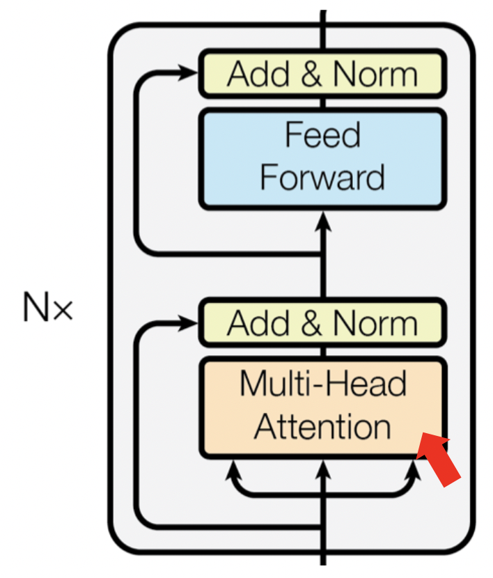
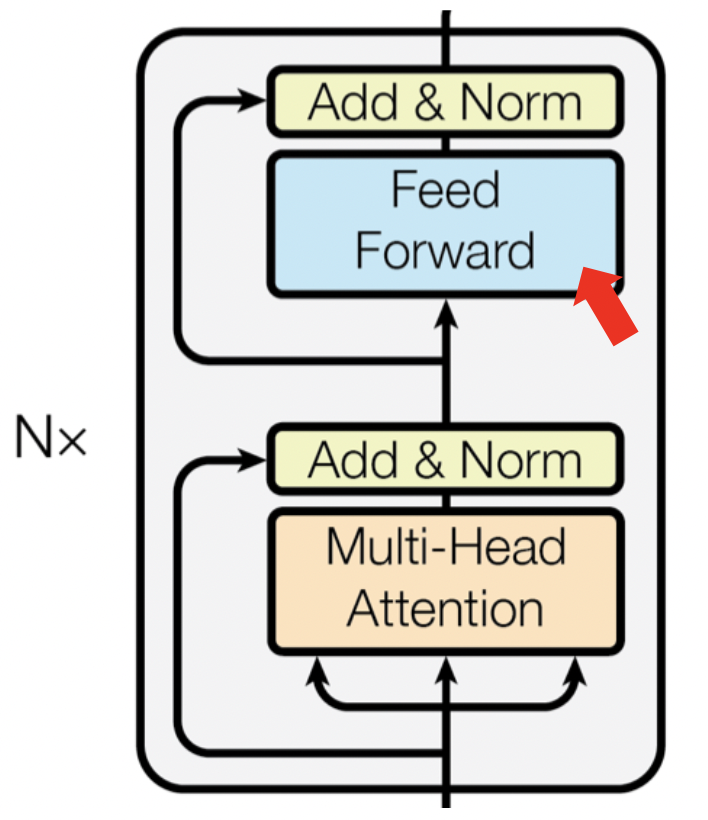

# learnGPT - week 2

## Requirements

### Python version
```bash
python --version
```
```text
Python 3.9.12
```
### Libraries used
```bash
pip3 install torch==1.13.1 pytest==7.2.1 pyyaml==6.0
```

## TODO's


### TODO - 1


### TODO - 2


### TODO - 3


### TODO - 4


### TODO - 5


## Introduction
week2에서는 week1에서 완성한 GPTVer3(one-head self-attention + positional encoding)와 HeadVer4(self-attention head)를 더 발전시켜 최종적으로 GPT를 구현하는 것을 목표로 합니다.


## MultiHeadVer1
  

week1에서 구현했던 HeadVer4(self-attention head)를 바탕으로 multi-head attention을 구현하고자 합니다. self-attention head에서 Q, K, V가 각각 FC layer를 통과하고나면 (batch_size, block_size, embed_size) → (batch_size, block_size, head_size)로 shape이 변경이 됩니다. 그리고 embed_size = head_size * n_heads의 관계가 성립합니다.

#### TODO
`input x를 n_heads 개의 self-attention head를 통과한 후 head_output을 concatnate합니다. 그리고 projection layer(FC)를 통과시켜 multi-head attention을 구현해주세요`


## MultiHeadVer2
MultiHeadVer2는 MultiHeadVer1의 연산을 행렬 연산과 reshape을 사용하여 구현한 것입니다.


## FeedForward


GPT block 중 FeedForward에 해당하는 부분입니다.


## BlockVer1


BlockVer1에서는 위에서 구현한 Multi-Head Attention과 FeedForward를 수행합니다.

#### TODO
`Multi-Head Attention을 통과한 뒤 FeedForward layer를 통과시켜 BlockVer1을 구현해주세요`


## BlockVer2


BlockVer2은 BlockVer1에서 Residual connection을 추가한 Block입니다.

#### TODO
`BlockVer1에서 Multi-Head Attention과 FeedForward에 대해 각각 residual Connection을 추가해주세요`


## LayerNormalization
#### TODO
`BlockVer3에서 사용할 Layer Nomalization을 구현해주세요`


## BlockVer3


#### TODO
`BlockVer2에서 LayerNorm layer를 추가해주세요. LayerNorm은 위의 그림처럼 Multi-Head의 input, FeedForward의 input, block의 최종 output에 총 3곳에 추가하시면 됩니다.`


## BlockVer4


#### TODO
`BlockVer3에서 Dropout layer를 추가해주세요. Dropout은 Multi-Head의 output, FeedForward의 output 총 2곳에 추가하시면 됩니다.`


## GPTVer3
GPTVer3는 Week1에서 구현했던 모델입니다.


## GPTVer4
GPTVer4는 GPTVer3에서 positional encoding대신 position embedding으로 구현한 모델로 position 정보를 embedding table을 학습하여 얻는 모델입니다.
